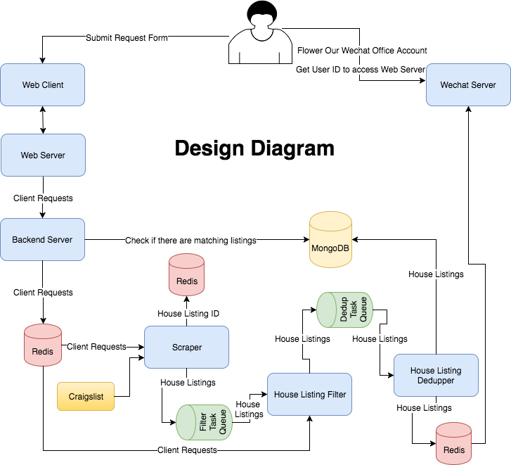
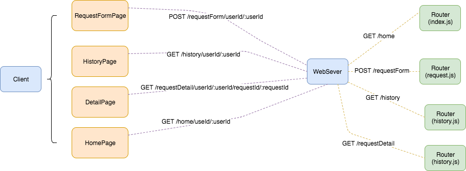

# WeChatBot-House-Finder
# Design Document
## Overview
WeChatBot-House-Finder is a system that helps clients to find a rent house quicker and easier. This document describes the design of the system in detail.
## Main Use Cases
* Users follow our WeChat offical account.
* We sends a link of submitting request to users.
* Users can submit their request through the link.
* Users can send "new" to our WeChat offical account to get new house listings.

## High Level Design Diagram
The system consists four parts:
* Front-end web server which includes web client and web server.
* Back-end server
* Data pipeline which includes scraper, filter, and deduper.
* WeChat server.

## Detail Design
### Front-end Web Server
The front-end web server consists web client and web server. The web client communicates with the web server by sending `RESTful` requests. We use `React` to build the web client, and `Node.js` and `Express` to build the web server. We use [`Goolge Materialize`](http://materializecss.com/) to design the UI.

The Web Client consists following components:
* RequestFormPage: this page shows a request form to clients. Clients can fill the form and submit to the server.
* HistoryPage: this page shows a list of request histories that clients sent to server.
* DetailPage: for each history request, there is detial page to show all the details of the request.
* HomePage: clients can access the RequestFormPage and HistoryPage through HomePage.
* NavigationBar: NavigationBar consists application name and two buttons: home and history. Clients can go to the HomePage and HistoryPage by click these two buttons.

The RESTful API is shown below.

The web server is an `Express` server. Once the web server receives requests from client, it forwards the requests to the back-end server through RPC. We use `python-jsonrpc`.

### Back-end Server
The back-end server handle RPC from the web server. Based on the clients' requests, it fetchs the cooresponding data from database. In addition, the back-end server also store the client request into Redis so that the data pipeline can scrape the data based the requests.

### Data Pipeline
*  Data Flow
  1.  Once `Client Request Service` gets a request from a client, it first checks if database has matched house listing. If there is a listing found, then it sends notification to the client.
  1.  Then store the request into `Redis`.
  1.  For every 10 minutes, the `Scraper` loops over the requst in Redis, and scrape available house listings from `Craigslist`.
  1.  Once a listing scraped by `Scraper`, it checks if the listing's id is in Redis. If the listing's id does not exist, store the listing's id into Redis, and send the listing to `Filter Task Queue`.
  1.  `House Listing Filter` fetches house listings which includes the client's id from `Filter Task Queue`. Based on the client's id, `House Listing Filter` acquires the client request from Redis. Then, send the house listing which matches the request into `Dedup Task Queue`.
  1.  `House Listing Dedupper` fetchs the listings from `Dedup Task Queue`, and performs dedupping base on image id in the listings. Then, store the listings into `MongoDB` and push them into `Notification Task Q    ueue` so that notification service can fetch the new house listings and sends clients notifications.

The diagram of the data flow is shown below.

* Implementation Details
  * Data Structures
    *   *Client Request*. The details of the Client Request is in Table 1.
    *   *House Listing*. The details of the House Listing is int Table 2.
  * Scraper
    * [`python-craigslist`](https://github.com/juliomalegria/python-craigslist) is used to scrape house listings from [Craigslist](https://www.craigslist.org/about/sites)
    * `area`, `city`, `max_bedroom`, `max_price`, `min_bedroom` and `min_price` from *Client Request* are passed to `CraigslistHousing` which is a class from [`python-craigslist`](https://github.com/juliomalegria/python-craigslist) to get list of house listings which match the part of client request.
    * Filter out the listings which does not contain the geotag. (TODO: may get the geotag from detail page)
    * Filter out the listings whose ID have already existed in Redis.
    * Construct *House Listing* object.
    * Send to `Filter Task Queue`.
  * House Listing Filter
    * Fetch a `House Listing` from `Filter Task Queue`.
    * Fetch the client request based on the `client_id` in `House Listing`.
    * Use [google-maps-services-python](https://github.com/googlemaps/google-maps-services-python) package to calculate the time token from the house to the work place based on the geotag.
    * Compare the result with the client requst.
    * Send the matched house listings into `Dedup Task Queue`.
    * TODO: may provide more filter items
  * House Listing Dedupper
    * Fetch a `House Listing` from `Dedup Task Queue`.
    * Use [BeautifulSoup](https://www.crummy.com/software/BeautifulSoup/) to extract the urls of the image in the house listing's detail page.
    * Compute the hash of the image urls.
    * Filter out the House Listings whose `image_url_hash` have already existed in database.
    * Store the House Listings into database and push them into notification queue as well

Table 1: Client Request

|Field | Descriptions|
|--- | ---|
|areas|list of strings, interested areas|
|city|string, interested city|
|departure_to_work|int, departure time of going to work|
|id|string, client id|
|max_bedroom|int, maximum number of bedrooms|
|max_time_to_work|long, maximum time from work to place by transit|
|max_price|int, maximum price|
|min_bedroom|int, minimum number of bedrooms|
|min_price|int, minimum price|
|time_to_work|int, duration of time from house to work (seconds)|
|time_to_work_delta|int, range of time_to_work, time_to_work +/- time_to_work_delta (seconds)|
|travel_mode|string, transit mode, e.g: driving, walking, transit|
|work_addr|string, the address or postal code of your work place|

Table 2: House Listing

Field | Discriptions
--- | ---
area|string, area
client_id|string, client id
lat|float, geographic code
lon|float, geographic code
image_url_hash|string, hash value of image urls
listing_id|string, listing id
location|string, location
post_date|date, listing post date
price|float, price of the house
url|string, url to the listing

### WeChat Server
When the clients send a message to our WeChat offical account, the message is forwarded to WeChat Server. We use `Flask` to build WeChat Server.

When the clients follow the WeChat office account, server sends a link that consists the request form to clients. Then, clients can be directed to the front-end server.

When the clients send "new" text message to sever, the server fetchs new listings from Redis.

## Deployment
This system is deployed on [Vultr](https://www.vultr.com/?123759383) cloud using Nginx and Docker.

## Future work
* Avoid scrape redundant data
* Use distributed system to scale the system
* Use MongoDB replication groups to replicate data to provide fault tolerance
* Use another application, such as Slack, WhatsApp, instead of WeChat to achieve notification services
* Use machine learning to predict rental
