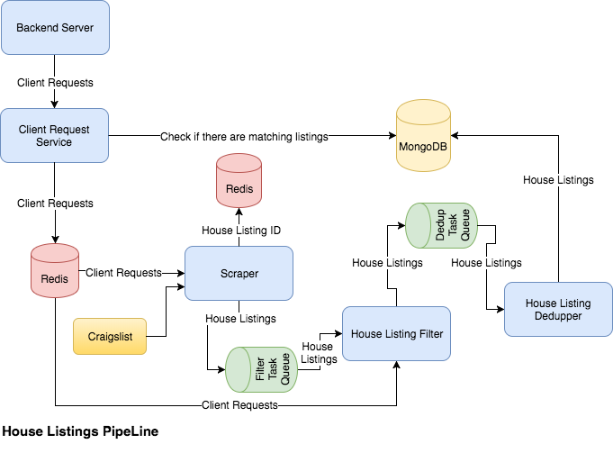

# Design Document
## Detail Design
### House Listings Pipeline
*  Data Flow
  1.  Once `Client Request Service` gets a request from a client, it first checks if database has matched house listing. If there is a listing found, then it sends notification to the client.
  1.  Then store the request into `Redis`.
  1.  For every 10 minutes, the `Scraper` loops over the requst in Redis, and scrape available house listings from `Craigslist`.
  1.  Once a listing scraped by `Scraper`, it checks if the listing's id is in Redis. If the listing's id does not exist, store the listing's id into Redis, and send the listing to `Filter Task Queue`.
  1.  `House Listing Filter` fetches house listings which includes the client's id from `Filter Task Queue`. Based on the client's id, `House Listing Filter` acquires the client request from Redis. Then, send the house listing which matches the request into `Dedup Task Queue`
  1.  `House Listing Dedupper` fetchs the listings from `Dedup Task Queue`, and performs dedupping base on image id in the listings. Then, store the listings into `MongoDB`

The diagram of the data flow is shown below.

* Implementation Details
  * Data Structures
    *   *Client Request*. The details of the Client Request is in Table 1.
    *   *House Listing*. The details of the House Listing is int Table 2.
  * Scraper
    * [`python-craigslist`](https://github.com/juliomalegria/python-craigslist) is used to scrape house listings from [Craigslist](https://www.craigslist.org/about/sites)
    * `area`, `city`, `max_bedroom`, `max_price`, `min_bedroom` and `min_price` from *Client Request* are passed to `CraigslistHousing` which is a class from [`python-craigslist`](https://github.com/juliomalegria/python-craigslist) to get list of house listings which match the part of client request.
    * Filter out the listings which does not contain the geotag. (TODO: may get the geotag from detail page)
    * Filter out the listings whose ID have already existed in Redis.
    * Construct *House Listing* object.
    * Send to `Filter Task Queue`.
  * House Listing Filter
    * Fetch a `House Listing` from `Filter Task Queue`.
    * Fetch the client request based on the `client_id` in `House Listing`.
    * Use [google-maps-services-python](https://github.com/googlemaps/google-maps-services-python) package to calculate the time token from the house to the work place based on the geotag.
    * Compare the result with the client requst.
    * Send the matched house listings into `Dedup Task Queue`.
    * TODO: may provide more filter items
  * House Listing Dedupper
    * Fetch a `House Listing` from `Dedup Task Queue`.
    * Use [BeautifulSoup](https://www.crummy.com/software/BeautifulSoup/) to extract the urls of the image in the house listing's detail page.
    * Compute the hash of the image urls.
    * Filter out the House Listings whose `image_url_hash` have already existed in database.

Table 1: Client Request

|Field | Descriptions|
|--- | ---|
|areas|list of strings, interested areas|
|city|string, interested city|
|id|string, client id|
|max_bedroom|int, maximum number of bedrooms|
|max_time_to_work|long, maximum time from work to place by transit|
|max_price|int, maximum price|
|min_bedroom|int, minimum number of bedrooms|
|min_price|int, minimum price|
|work_place_postal_code|string, the postol code of your work place|

Table 2: House Listing

Field | Discriptions
--- | ---
area|string, area
client_id|string, client id
geotag|string, geographic code
image_url_hash|string, hash value of image urls
listing_id|string, listing id
location|string, location
post_date|date, listing post date
price|float, price of the house
url|string, url to the listing
